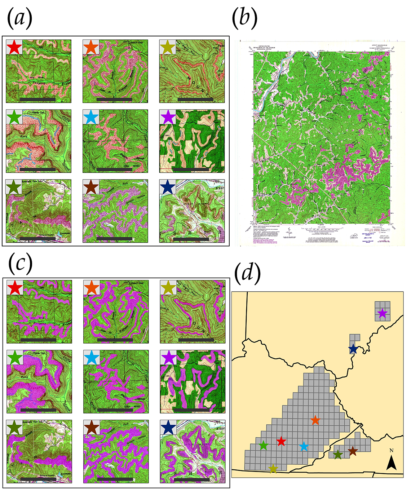

# topoDL
Semantic segmentation applied to historic topogrpahic maps
# UNet Semantic Segmentation for Extracting Historic Surface Mining Disturbance from Topographic Maps

---

## Description

This project explores the use of UNet semantic segmentation deep learning for extracting historic surface disturbance associated with coal mining from topographic maps. 

**Project Lead**

Aaron Maxwell, Assistant Professor, WVU Department of [Geology and Geography](https://www.geo.wvu.edu/)

Website: [WV View](http://www.wvview.org/)

**Project Collaborators** 
- WVU Geology and Geography: Michelle Bester (PhD Student, Geology), Luis A. Guillen (PhD Student, Forestry), Jesse Carpinello (MS student, Geology), Yiting Fan (PhD Student, Geography), Faith Hartley (MA Student, Geography), Shannon Maynard (MS Student, Geology), and Jaimee Pyron (MA Student, Geography)
- WVU John Chambers College of Business and Econonmics: Dr. Chris Ramezan, PhD (Assistant Professor)

**Aknowledgements**
- The United States Geological Survey provides public access to historic, scanned, and georeferenced topographic maps via the National Map’s Historical Topographic Map Collection. 
- The USGS Geology, Geophysics, and Geochemistry Science Center (GGGSC) created the example data used in this study.
- This research was partially funded by the National Geographic Society, Leonardo DiCaprio Foundation, and Microsoft via an AI for Earth Innovation grant, which provided access to computational resources via Microsoft Azure.

#### Technologies

- [UNet](https://keras.rstudio.com/articles/examples/unet.html)
- [Keras](https://keras.rstudio.com/index.html)
- [R](https://cran.r-project.org/)
- [ArcGIS Pro/Export Training Data for Deep Learning](https://pro.arcgis.com/en/pro-app/tool-reference/image-analyst/export-training-data-for-deep-learning.htm)

#### R Packages

- [keras](https://cran.r-project.org/web/packages/keras/index.html)
- [tidyverse](https://cran.r-project.org/web/packages/tidyverse/index.html)
- [dplyr](https://cran.r-project.org/web/packages/dplyr/index.html)
- [ggplot2](https://cran.r-project.org/web/packages/ggplot2/index.html)
- [cowplot](https://cran.r-project.org/web/packages/cowplot/index.html)

---

## How To Use

#### Set Up Notes

- We conducted our experiments on a Windows 10 machine using a GPU. This required setting up the NVIDIA CUDA Toolkit and cuDNN. [This](https://towardsdatascience.com/python-environment-setup-for-deep-learning-on-windows-10-c373786e36d1) is a good tutorial for setting up a DL environment in Windows.
- R actually uses Python to implement Keras. So, you will need to set up a Python DL environment. We used [Anaconda](https://www.anaconda.com/).
- You will need to link to your conda environment in R using [reticulate](https://cran.r-project.org/web/packages/reticulate/index.html).

#### Implementation Specifics

- This project used a modified version of UNet. Specifically, we used a leaky ReLU activation function for the convolutional layers. We also optimized using Adamax and the Dice loss metric. 
- Image processing in R was conducted using keras and [magick](https://cran.r-project.org/web/packages/magick/index.html).
- An image chip size of 128-by-128 pixels was used. The image masks are binary (1 = mining, 0 = background). Images and masks are in PNG format with spatial reference information.

#### Files

- **model_prediction_evalaution.R**: main file for image and dataset pre-processing, UNet model compiling, model training, and model evaluation. We also include code to predict back to entire topographic maps. Training the model required roughly 24 hours on our single GPU machine. Predicting to a single topographic map took roughly 15 minutes. 
- **chip_prep.ipynb**: code for creating image chips (just chips with mining present). This makes use of the Export Training Data for Deep Learning Tool in ArcGIS Pro. 
- **chip_prep_background**: code for creating image chips (all chips). This makes use of the Export Training Data for Deep Learning Tool in ArcGIS Pro. 
- **sample_size_experiments.R**: code used to compare models that used subsets of the training chips.
- **loss_graphs.R**: code to generate loss graphs with ggplot2.
- **sample_size_loss_graphs.R**: code to generate loss graphs with ggplot2 to compare models using different sample sizes. 
- **sample_size_metrics.R**: create metrics and plots to compare models using different sample sizes. 
- **boxplots**: code to generate boxplots using ggplot2.
- **remove_ponds.R**: code to remove ponds from the example data. 
- **tables.zip**: tables used to generate graphs. 

